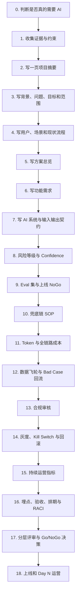
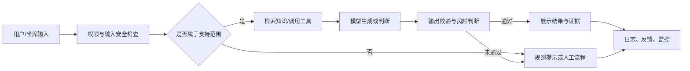
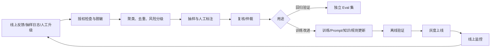

# AI 产品 PRD 写作全流程

> 基于视频《AI产品经理_PRD_模板_大厂PM_偷偷加的8章_99_的_PM_还在用传统_PRD_模板写_AI》全片学习、逐段转写与关键画面核对整理。  
> 视频时长：08:10；整理日期：2026-07-13。  
> 这不是对视频文案的机械誊抄，而是一份可以直接用于真实项目的“视频原意 + 落地补充/校正 + 可复制模板”。

---

## 0. 先读这三条

### 0.1 这支视频真正讲的是什么

传统 PRD 主要回答：**为什么做、给谁做、做什么、流程和规则是什么。**

AI 产品还必须回答：

1. 模型不确定时怎么办；
2. 上线前怎么证明“够好”；
3. 出错后怎么降级、兜底和回滚；
4. 每次调用、每天和每月要花多少钱；
5. 数据、内容、偏见和审计如何合规；
6. 上线后如何监控、复盘和持续变好。

视频将这些问题归纳成八个新增章节：

1. 风险等级 + Confidence 阈值矩阵；
2. Eval 集设计 + 上线 NoGo 标准；
3. 兜底链分层 SOP；
4. Token 成本预算；
5. 数据飞轮 + Bad Case 回流；
6. 合规审核章节；
7. 灰度方案 + 回滚 SOP；
8. 持续运营指标。

### 0.2 本文的标记规则

- **【视频原意】**：视频画面或语音明确讲到的内容。
- **【落地补充/校正】**：为了让 PRD 真正可执行而增加的方法、字段和检查项，或对视频中不宜直接照搬之处的修正。除明确标为“视频原意”的段落外，本文模板和操作方法均属于这一类。
- **【谨慎照搬】**：视频给出了固定数字，但真实项目必须通过数据、实验或评审重新确定。

### 0.3 必须先校正视频里的五个“固定答案”

视频中的 `0.90/0.80/0.70`、`至少 200 条`、`80%/15%/5%`、`5%/20%/50%/100%`、`月预算偏差 20%` 都适合当**示例模板**，不适合当通用行业标准。

真实项目中：

- 阈值必须从校准过的 Eval 结果中得出，不能凭感觉填写；
- Eval 集的价值取决于场景覆盖，不只取决于条数；
- 兜底比例取决于风险、业务量、人工能力和用户体验；
- 灰度档位取决于流量、统计效力和影响范围；
- 预算告警线取决于财务上限和毛利目标。

视频中的公司案例、处罚金额和行业统计没有给出可核验来源，本文只把它们当作风险说明，不当作已证实事实。

---

## 1. 一张图看懂完整写作流程



### 每个阶段的完成物

| 阶段 | 你要产出的东西 | 通过条件 |
|---|---|---|
| 立项 | 一页项目摘要、证据表、非 AI 基线 | 能说明为什么现在做、为什么用 AI |
| 定义 | 用户场景、目标、非目标、范围 | 业务、用户和产品对问题达成一致 |
| 方案 | 主流程、功能需求、AI 链路、数据契约 | 工程能估时，设计能出稿，测试能写用例 |
| 风险与质量 | 风险矩阵、Eval 集、NoGo、兜底链 | 低质量、长尾和高风险输入都有去处 |
| 商业与治理 | 成本、数据飞轮、合规 | 财务、数据、安全和法务知道自己审什么 |
| 上线与运营 | 灰度、回滚、监控、复盘 | 出问题能发现、能止损、能追溯、能恢复 |

---

# 第一部分：从 0 到 1 写一份完整 AI PRD

## 第 0 步：先判断这件事是否真的需要 AI

### 目的

避免把“商品推荐”改成“AI 商品推荐”就当成完成了方案。AI 会额外带来概率性、成本、延迟、数据和合规风险，必须证明它比规则、搜索或人工流程更合适。

### 信息从哪里来

- 当前业务流程和人工成本；
- 用户问题的开放程度、长尾程度和重复程度；
- 规则或传统算法的当前效果；
- 一个最小 PoC 的质量、延迟和成本；
- 数据是否可用、可授权、可持续更新；
- 失败后是否允许人工确认或规则兜底。

### 怎么写

```markdown
## 为什么使用 AI

- 当前任务：
- 非 AI 基线方案：规则 / 搜索 / 人工 / 传统模型
- 基线效果与成本：
- AI 预计解决的核心缺口：
- AI 的不可替代价值：
- AI 新增的风险：
- 失败时是否可逆：
- 初步结论：使用 AI / AI 辅助 / 暂不使用 AI
```

### 判断问题

- 输入是否高度非结构化，规则难以穷举？
- 用户是否真的需要生成、理解、归纳或推理？
- 错一次的伤害是否可以接受、阻断或恢复？
- 是否有足够数据做验证，而不只是演示一个顺利样例？
- AI 带来的价值是否大于调用、运营、人工审核和风险成本？

### 完成标准

至少有一个可比较的非 AI 基线；如果没有基线，就无法判断 AI 方案到底有没有增量价值。

---

## 第 1 步：先收集证据，再打开 PRD

### 目的

PRD 中每个关键数字都应该有来源。先把事实、假设和待验证项分开，后面写阈值、成本、目标时才不会拍脑袋。

### 建立“证据与假设表”

| 编号 | 结论或假设 | 类型 | 证据来源 | 样本/时间范围 | 可信度 | 负责人 | 下一步 |
|---|---|---|---|---|---|---|---|
| E-01 | 售后咨询中有较多重复问题 | 已知事实 | 工单分类统计 | 近 30 天 | 高 | 数据分析 | 补充分渠道占比 |
| A-01 | AI 可减少人工首次响应时间 | 待验证假设 | PoC | 100 条样例 | 中 | 产品/算法 | 扩大 Eval 集 |

> 上表内容为写法示例，必须替换为项目真实数据。

### 最少要收集的十类输入

1. 业务目标与财务约束；
2. 用户访谈、工单、搜索词或行为数据；
3. 当前流程、等待时间、错误率和人工成本；
4. 非 AI 基线效果；
5. 历史正常样例、长尾样例和 Bad Case；
6. 数据来源、质量、权限和更新频率；
7. 模型/供应商能力、价格、限额和 SLA；
8. 技术依赖、接口、知识库和工具能力；
9. 安全、隐私、行业和法务约束；
10. 运营、客服、审核与 SRE 的承接能力。

### 完成标准

- 事实、推断、目标和假设没有混写；
- 每个关键指标能追溯到来源；
- 无证据的数字标记为 `待验证`，而不是伪装成结论。

---

## 第 2 步：写一页项目摘要，让决策者先看懂

### 目的

先让读者在一页内回答：做什么、为什么、给谁、价值多大、风险是什么、需要作什么决定。

### 推荐结构

```markdown
## 一页项目摘要

- 项目名称：
- 一句话定义：为[用户]在[场景]下提供[能力]，解决[问题]。
- 当前问题及证据：
- 目标用户与核心场景：
- 方案概述：
- 为什么使用 AI：
- 目标指标：
- 主要风险：
- 预计成本：
- 计划上线范围与时间：
- 本次评审需要决定：Go / Conditional Go / NoGo / 其他
```

### 好的“一句话定义”

> 为电商售后坐席提供答案建议与证据引用，减少查找知识所需时间；高风险退款决策仍由人工确认。

它写清了用户、场景、能力、价值和边界。不要只写“打造智能化售后平台”。

---

## 第 3 步：写背景、问题、目标、非目标和范围

### 3.1 背景与问题怎么来

从用户研究、业务数据和现状流程中提取，不从方案倒推问题。

```markdown
## 背景与问题

### 现状
- 谁在什么场景完成什么任务：
- 当前流程：
- 当前基线：时长 / 成功率 / 成本 / 投诉 / 其他

### 问题
- 用户问题：
- 业务问题：
- 根因：
- 若不解决的后果：

### 证据
- 定量：
- 定性：
- 证据限制：
```

### 3.2 目标怎么写

目标必须包含基线、目标值、时间窗、统计口径和负责人。

| 指标 | 定义/公式 | 当前基线 | 目标 | 时间窗 | 数据源 | 负责人 |
|---|---|---:|---:|---|---|---|
| 任务成功率 | 成功完成任务数 / 有效任务数 | 待填 | 待填 | 上线后 4 周 | 事件表 | 产品 |
| P95 延迟 | 95% 请求完成时间不超过该值 | 待填 | 待填 | 灰度期 | 监控平台 | 工程 |

### 3.3 同时写非目标

```markdown
## 非目标

- 本期不自动执行高风险退款；
- 本期不覆盖非中文输入；
- 本期不训练自有基础模型；
- 本期不替代人工最终审批。
```

非目标不是“以后不做”，而是保护本期范围。

### 3.4 范围表

| 场景 | 本期状态 | 优先级 | 原因 | 后续计划 |
|---|---|---|---|---|
| 标准售后问答 | In Scope | P0 | 高频、低风险 | 首期上线 |
| 退款资格判定 | Assist Only | P0 | 高风险，需人工确认 | 先辅助后评估 |
| 法律争议答复 | Out of Scope | - | 风险不可接受 | 转人工 |

### 完成标准

- 目标不是功能列表；
- 业务指标、模型质量、系统性能和安全指标分别定义；
- 明确 AI 能做、不能做、只能辅助做的事情。

---

## 第 4 步：写用户、场景、任务和现状流程

### 信息从哪里来

- 访谈和现场观察；
- 工单、聊天、搜索词和行为路径；
- 一线人员的例外处理方式；
- 高风险、长尾、边界和对抗场景。

### 四层写法

1. **用户角色**：谁使用、谁受影响、谁审批；
2. **Job to be Done**：用户真正要完成什么；
3. **用户故事**：在何种条件下要什么能力；
4. **场景样例**：给出真实输入、上下文、预期输出和不能接受的输出。

```markdown
## 用户故事 US-01

作为：售后坐席
当：用户询问订单退款条件时
我希望：快速得到带政策出处的答案建议
从而：缩短查找时间并保持回答一致

前置条件：订单和政策信息已授权读取
成功结果：答案有引用，坐席可编辑后发送
失败结果：证据不足时明确提示并转人工查询
```

### 场景必须分层

| 场景层 | 示例 | PRD 中的处理 |
|---|---|---|
| Happy Path | 信息完整、政策明确 | 正常主流程 |
| Long-tail | 少见商品或复杂组合条件 | 补充检索或人工确认 |
| Boundary | 刚好跨越时限、金额边界 | 明确规则和提示 |
| Bad Case | 历史上答错、投诉过的输入 | 加入 Eval 与回流 |
| Adversarial | Prompt 注入、越权索取数据 | 安全阻断与留痕 |
| Dependency Failure | 知识库、订单接口或模型超时 | 进入兜底链 |

### 完成标准

主流程、异常流程、风险场景都有具体输入和预期结果；不能只写“用户发起提问，AI 返回答案”。

---

## 第 5 步：写方案总览，而不是直接堆功能

### 先画清系统边界



### 方案总览必须回答

- AI 在链路中负责哪一步；
- 哪些步骤由规则、检索、工具或人工完成；
- 输入从哪里来，输出给谁；
- 哪些数据会被保存；
- 哪些决策必须由人确认；
- 失败后如何继续完成用户任务；
- 非 AI 基线是否仍保留。

### 推荐写法

```markdown
## 方案总览

### 方案原则
- 可验证：关键回答必须能追溯证据；
- 可降级：模型不可用时仍能完成最低可用任务；
- 人可控：高风险动作必须人工确认；
- 可观测：质量、延迟、成本和安全均可监控。

### 主链路
1. ...
2. ...

### 系统边界
- AI 负责：
- 规则负责：
- 人工负责：
- 本期不负责：
```

---

## 第 6 步：把功能需求写成工程、设计、测试都能执行的单元

### 一个功能需求的最低结构

```markdown
## FR-01 [功能名称]

- 目的：
- 优先级：P0 / P1 / P2
- 关联用户故事：US-xx
- 触发条件：
- 前置条件：
- 输入：字段、格式、长度、权限、是否含敏感信息
- 主流程：
- AI 行为：使用哪些上下文、知识和工具
- 输出契约：格式、字段、引用、可编辑性
- 业务规则：
- 异常与兜底：
- 安全与合规：
- 埋点：
- 验收标准：Given / When / Then
- 负责人：
```

### 示例：答案建议

```markdown
## FR-01 生成带证据的售后答案建议

- 触发条件：坐席打开有效售后会话并点击“生成建议”
- 输入：用户问题、订单状态、已授权政策文档
- 主流程：识别意图 → 检索政策 → 生成答案 → 校验证据 → 展示
- 输出契约：answer、citations[]、risk_level、fallback_reason
- 业务规则：不得自动向用户发送；坐席确认后方可发送
- 异常与兜底：检索为空、引用不一致或高风险时不生成确定性结论
- 验收：给定证据不足的退款问题，当用户请求答案时，则提示“证据不足”并进入人工查询流程
```

### 常见错误

- 写“系统应智能识别”，却没有输入、输出和判定标准；
- 只写主流程，不写异常、超时、空结果和权限不足；
- 把模型名称当需求，不写用户价值和行为契约；
- 验收标准写成“效果好”“体验流畅”。

---

## 第 7 步：补齐 AI 系统设计与输入输出契约

视频结尾提到了 Prompt、Context、RAG、MCP、Function Calling、Agent、Eval 和 Tool Schema，但没有在本期逐项展开。真实 PRD 至少要把以下内容写到可评审程度。

### 7.1 输入契约

| 输入 | 来源 | 必填 | 格式/上限 | 权限 | 敏感性 | 缺失处理 |
|---|---|---|---|---|---|---|
| 用户问题 | 会话 | 是 | 文本，待填上限 | 当前会话 | 可能含个人信息 | 脱敏或阻断 |
| 订单状态 | 订单接口 | 视场景 | 枚举 | 授权订单 | 个人信息 | 转人工 |

### 7.2 上下文与知识

- System Prompt 的职责和禁止事项；
- 会话历史保留轮数和截断规则；
- RAG 的知识来源、切分、更新频率和权限过滤；
- 引用要求和“无证据不作答”规则；
- 知识过期、冲突或检索为空时怎么处理。

### 7.3 模型与工具

| 能力 | 实现方式 | 主方案 | 备选/降级 | 选择依据 | 版本负责人 |
|---|---|---|---|---|---|
| 意图识别 | 分类模型/规则 | 待填 | 待填 | Eval、成本、延迟 | 算法 |
| 查订单 | Tool/API | 待填 | 人工查询 | 权限、SLA | 后端 |

### 7.4 输出契约

```json
{
  "answer": "string",
  "citations": [{"source_id": "string", "quote": "string"}],
  "risk_level": "low|medium|high",
  "decision": "answer|clarify|fallback|block",
  "fallback_reason": "string|null"
}
```

JSON 只是示例。真实字段要写类型、枚举、是否可空、校验规则和版本号。

### 7.5 版本与可追溯性

每次结果至少能关联：模型版本、Prompt 版本、知识库版本、工具版本、策略版本、请求时间和实验组。否则出现问题时无法复现。

---

# 第二部分：视频八章的完整落地写法

## 八章放置位置总表

| 视频章节 | 推荐放在 PRD 哪里 | 最低必写内容 | 主要评审方 |
|---|---|---|---|
| 1. 风险等级 + Confidence 阈值矩阵 | 项目背景之后、核心需求之前 | 风险等级、置信信号、阈值、兜底比例 | 产品、算法、风控/法务 |
| 2. Eval 集 + 上线 NoGo | 核心功能之后、数据章之前 | Eval 分层、样例覆盖、质量/安全/延迟门槛 | 算法、测试、产品 |
| 3. 兜底链分层 SOP | 错误处理/异常流程 | L1/L2/L3、触发条件、比例、告警 | 工程、客服/运营 |
| 4. Token 成本预算 | 成本估算/商业可行性 | P50/P95 成本、日/月预算、降级策略 | 财务、产品、工程 |
| 5. 数据飞轮 + Bad Case 回流 | 数据章/运营章 | 反馈回流、标注 SOP、迭代周期、飞轮指标 | 数据、算法、运营 |
| 6. 合规审核 | 合规章/风控章 | 脱敏、内容安全、偏见、留痕 | 法务、安全、风控 |
| 7. 灰度 + 回滚 SOP | 上线计划章 | 灰度档位、Kill Switch、回滚条件与权限 | SRE、工程、产品 |
| 8. 持续运营指标 | 运营章/监控章 | 漂移、翻车率、触发率、复盘、预算告警 | 运营、算法、SRE、产品 |

---

## 第 8 步 / 视频第 1 章：风险等级 + Confidence 阈值矩阵

### 【视频原意】

- 放在“项目背景之后、核心需求之前”；
- 写项目风险等级：高 / 中 / 低；
- 写 Confidence 阈值示例：0.90 / 0.80 / 0.70；
- 写触发兜底链的比例预估；
- 目的：评审首先会问“翻车了怎么办”。

### 【落地补充/校正】第 8、9 步要迭代执行

第 8 步先完成风险分级、候选置信信号和暂定动作，但**不能在 Eval 建好前冻结最终阈值**。第 9 步完成分场景 Eval 后，要回到第 8 步校准阈值、误放率、兜底率和人工容量，再将两章一起冻结。

### 信息从哪里来

1. 用户场景和可能伤害；
2. 历史错误、投诉和人工升级记录；
3. 模型在分场景 Eval 集上的表现；
4. 法务、安全、运营对风险的判断；
5. 失败是否可发现、可恢复、可由人接管。

### 先定义风险，再定阈值

建议从以下维度判断，不要只看“答案像不像”：

| 维度 | 要问的问题 |
|---|---|
| 影响严重度 | 答错会造成不便、损失、合规问题，还是人身/财务伤害？ |
| 发生可能性 | 该场景多频繁，模型过去多常失败？ |
| 可检测性 | 错误能否在给用户前被规则、工具或人发现？ |
| 可逆性 | 错误发生后能否撤回、补救或赔偿？ |
| 影响范围 | 影响一个用户、一个群体，还是全量用户？ |
| 用户脆弱性 | 是否涉及未成年人、病患、求职者等需要额外保护的人群？ |

### 风险分级模板

| 场景 | 可能失败 | 影响 | 风险等级 | AI 可做什么 | 人是否必须确认 | 失败去向 |
|---|---|---|---|---|---|---|
| 政策问答 | 引用过期政策 | 误导用户 | 中 | 生成带引用建议 | 坐席发送前确认 | 检索重试/人工 |
| 自动退款 | 错判退款资格 | 资金损失 | 高 | 只给建议 | 是 | 人工审批 |
| 欢迎语改写 | 语气不佳 | 轻微体验损失 | 低 | 可自动生成 | 否 | 使用默认文案 |

> 表中内容是示例，不是对任何真实业务的风险结论。

### Confidence 不能怎么写

不要直接让大模型说“我有 93% 的信心”。生成模型的自报信心通常不等于真实正确概率。

### Confidence 可以来自什么

- 校准过的分类器概率；
- 检索覆盖率、引用一致性或 groundedness 检查；
- 结构化字段和业务规则校验；
- 工具调用是否成功、返回数据是否完整；
- 多模型或多次结果的一致性；
- 安全分类器和敏感内容检测；
- 人工审核结果。

如果项目没有可靠的可校准分数，就不要伪造 `0.87`。可以写“命中以下规则才回答，否则澄清/兜底”。

### Confidence 阈值矩阵模板

| 场景/风险 | 置信信号定义 | 阈值依据 | 允许动作 | 未达阈值动作 | 目标兜底率 | Owner |
|---|---|---|---|---|---:|---|
| 高风险 | 引用一致 + 规则校验 + 分类器分数 | 独立验证集校准 | 仅给人工建议 | 阻断并转人工 | 待测 | 风控/算法 |
| 中风险 | 检索覆盖 + 分类器分数 | Eval 曲线 | 给可编辑建议 | 追问或规则兜底 | 待测 | 产品/算法 |
| 低风险 | 格式与安全检查 | Eval 曲线 | 自动返回 | 默认文案 | 待测 | 产品 |

### 阈值是怎么“算出来”的

1. 按风险场景准备独立验证集；
2. 对每条样例记录置信信号与真实对错；
3. 绘制不同阈值下的准确率、召回率、误放率和兜底率；
4. 先确定不可接受的误放上限，再选择满足它的阈值；
5. 计算该阈值带来的人工量、延迟和成本；
6. 由产品、算法、风控和运营共同签字；
7. 上线后按真实分布重新校准并版本化。

### 完成标准

- 每个高风险场景都有明确动作边界；
- “置信度”有可计算定义；
- 阈值有数据依据，而不是沿用视频数字；
- 未达阈值时有确定去向；
- 人工量和兜底容量经过估算。

---

## 第 9 步 / 视频第 2 章：Eval 集设计 + 上线 NoGo 标准

### 【视频原意】

- 放在“核心功能之后、数据章之前”；
- Eval 集示例规模为“至少 200 条”；
- 分为单元、链路、端到端三层；
- 上线 NoGo 要包含准确率、翻车率、P95 延迟等阈值；
- 没有 Eval 集等于无法证明上线质量。

### 【谨慎照搬】

“至少 200 条”是视频给出的起步示例，不是充分条件。200 条同质 Happy Path 远不如 150 条覆盖明确、标注可靠、包含边界与对抗输入的样例。高风险或多语言产品通常需要更多。

### Eval 集从哪里来

- 真实历史请求与工单，经授权、脱敏后抽样；
- 用户研究中的关键任务；
- 线上 Bad Case；
- 产品、算法、测试共同设计的边界样例；
- 安全团队设计的对抗样例；
- 新场景、新语言、新渠道和新知识版本样例。

### 先做覆盖矩阵

| 场景 | 正常 | 长尾 | 边界 | Bad Case | 对抗 | 依赖失败 | 高风险 |
|---|---:|---:|---:|---:|---:|---:|---:|
| 政策问答 | 待填 | 待填 | 待填 | 待填 | 待填 | 待填 | 待填 |
| 退款建议 | 待填 | 待填 | 待填 | 待填 | 待填 | 待填 | 待填 |

只有覆盖矩阵填完，才讨论总条数。

### 三层 Eval 怎么写

| 层级 | 测什么 | 示例 |
|---|---|---|
| 单元 Eval | 单一能力是否正确 | 意图分类、字段提取、引用一致性、安全分类 |
| 链路 Eval | 多组件组合是否正确 | 检索 → 生成 → 校验，或模型 → 工具 → 结果解析 |
| 端到端 Eval | 用户任务是否真正完成 | 从用户输入到最终可用结果、兜底和日志是否完整 |

### 每条 Eval Case 的字段

```yaml
case_id: E2E-001
scenario: 售后政策问答
risk_level: medium
tags: [long_tail, citation_required]
input: 用户原始问题
context: 允许使用的订单与政策信息
expected_behavior: 应先澄清商品状态，再给出带引用建议
acceptable_variants: 允许的表述差异
must_not: 不得虚构政策，不得自动承诺退款
scoring_rule: 评分规则或人工 Rubric
data_source: 样例来源
reviewer: 标注/复核人
dataset_split: validation / test / redteam
```

### 指标不能只写“准确率”

| 指标类别 | 可选指标 | 必须写清的口径 |
|---|---|---|
| 任务质量 | 任务成功率、准确率、召回率、引用正确率 | 分母、人工评分规则、是否分场景 |
| 风险安全 | 翻车率、误放率、越权率、错误拒绝率 | 什么算翻车、严重级别、抽检方式 |
| 系统性能 | P50/P95/P99 延迟、错误率、可用性 | 起止时间、超时是否计入 |
| 用户体验 | 接受率、编辑率、CSAT、人工升级率 | 观察窗、样本量、偏差 |
| 成本 | P50/P95 单次成功任务成本 | 是否包含重试、工具和人工 |

### 上线 NoGo 门槛表

| Gate | 指标 | 目标/红线 | 测试集 | 最低样本 | Owner | 不通过动作 |
|---|---|---|---|---:|---|---|
| G1 质量 | 高风险误放率 | 待评审 | 高风险独立集 | 待填 | 算法/风控 | NoGo |
| G2 安全 | 严重安全违规 | 0 个或项目定义 | Red Team 集 | 待填 | 安全 | NoGo |
| G3 性能 | P95 延迟 | 待评审 | 压测 | 待填 | 工程 | 优化/降级 |
| G4 成本 | 单次成功任务 P95 成本 | 不超过预算 | 成本压测 | 待填 | 产品/财务 | 降级/限流 |
| G5 运营 | 预计人工兜底量 | 不超过容量 | 仿真 | 待填 | 运营 | 限量灰度 |

### Go/NoGo 的写法

```markdown
上线决策规则：

- 任一 P0 安全 Gate 不通过：NoGo；
- P1 指标未达标但有可验证的降级方案：Conditional Go；
- 所有强制 Gate 通过，回滚演练完成，负责人签字：Go；
- 任何指标口径或数据来源未确认：不得以“默认通过”处理。
```

### 防止 Eval 被“刷分”

- 训练集、调参集、验收集分离；
- 最终测试集在决策前不反复暴露；
- 防止同源样例泄漏；
- 记录模型、Prompt、知识库、工具和数据集版本；
- 总分之外必须看分场景和分风险结果；
- 定期把线上新 Bad Case 加入新的回归集，而不是偷偷修改旧答案。

### 完成标准

Eval 不只是一个 Excel 文件；它必须能复现、能版本化、能自动或稳定人工评分，并直接驱动上线决策。

---

## 第 10 步 / 视频第 3 章：兜底链分层 SOP

### 【视频原意】

- 放在“错误处理章 / 异常流程章”；
- 三层结构：L1 自动降级、L2 规则兜底、L3 人工兜底；
- 视频给出占比目标示例 `80% / 15% / 5%`；
- 每层要写触发率告警阈值；
- 工程会按这一章实现，缺失时容易产生理解偏差。

### 先列全失败类型

| 失败类型 | 例子 | 能否自动发现 | 默认处理 |
|---|---|---|---|
| 低置信 | 检索证据不足 | 是 | 澄清/规则/人工 |
| 模型超时 | 请求超过上限 | 是 | 切换模型或默认结果 |
| 工具失败 | 订单接口不可用 | 是 | 重试后转人工 |
| 输出不合法 | JSON 缺字段 | 是 | 重新生成或规则修复 |
| 安全风险 | 越权、敏感内容、Prompt 注入 | 是/部分 | 阻断并留痕 |
| 事实错误 | 表面合理但答案错误 | 部分 | 引用校验、抽检、人工 |
| 成本异常 | 循环调用或 Token 激增 | 是 | 截断、限流、Kill Switch |

### 三层兜底模板

| 层级 | 触发条件 | 动作 | 用户看到什么 | SLA | 目标占比 | 日志 | Owner |
|---|---|---|---|---|---:|---|---|
| L1 自动降级 | 主模型超时/成本过高 | 切轻量模型、缩短上下文、只检索 | 明确提示能力受限 | 秒级 | 待测 | fallback_l1 | 工程 |
| L2 规则兜底 | 低置信、字段缺失 | 固定规则、追问、模板答案 | 要求补充信息 | 秒级 | 待测 | fallback_l2 | 产品/工程 |
| L3 人工兜底 | 高风险、规则无法处理 | 创建人工工单并带上下文 | 告知预计处理时间 | 分钟/小时级 | 待测 | fallback_l3 | 运营 |

### 一条完整 SOP 要写什么

```markdown
## SOP-FB-01 检索无结果

- 触发：检索结果为空，或最高相关结果低于已校准门槛
- L1：改写查询并重试 1 次
- L2：询问用户缺失信息；不得生成确定性答案
- L3：仍无结果时创建人工任务，并附原问题、检索词、已尝试动作
- 用户文案：
- 超时上限：
- 最大重试：
- 记录字段：
- 告警：5 分钟窗口内触发率超过基线 + X%（待定）
- 恢复条件：
- Owner：
```

### 【谨慎照搬】80/15/5

这组比例可以作为容量估算起点，但不能当质量目标。低风险文案产品可能几乎不需要人工，高风险金融或医疗辅助场景可能必须大量人工确认。真正要优化的是**成功完成任务且风险可接受**，不是强行把 80% 请求留在自动层。

### 兜底验收

- 主模型断开时演练一次；
- 检索为空、工具超时、输出非法、安全阻断分别演练；
- 确认用户得到可理解的状态，而不是无限转圈；
- 确认人工收到完整上下文，不让用户重新描述；
- 确认所有兜底都记录原因和版本；
- 确认兜底本身不会越权或泄露数据。

---

## 第 11 步 / 视频第 4 章：Token 成本预算

### 【视频原意】

- 放在“成本估算章 / 商业可行性章”；
- 写 P50 和 P95 单次请求成本；
- 写日预算和月预算上限；
- 写超预算降级策略：切便宜模型、限流、关闭非核心能力；
- 目的：回答“这个产品一个月烧多少钱”。

### 先统一成本口径

只算 Token 会低估真实成本。建议计算：

```text
单次请求成本
= 输入 Token 成本
+ 输出 Token 成本
+ Embedding / 检索 / 向量库成本
+ Tool / 第三方 API 成本
+ 重试与多 Agent 调用成本
+ 内容安全与评测调用成本
+ 基础设施分摊
+ 人工审核或兜底成本

单次成功任务成本
= 一个任务内所有请求与失败重试总成本 / 成功完成的任务数
```

### 使用量从哪里来

- 当前业务日请求量与峰值；
- 新功能的预计渗透率；
- 每个任务平均轮数、工具次数和重试次数；
- 输入/输出 Token 分布，而不只看平均值；
- 灰度、节假日、活动和异常流量情景。

### 成本估算表

| 项目 | P50 | P95/峰值 | 单价来源与日期 | 日调用量 | 月成本 | 备注 |
|---|---:|---:|---|---:|---:|---|
| 主模型输入 | 待填 | 待填 | 供应商报价 | 待填 | 待填 | Token |
| 主模型输出 | 待填 | 待填 | 供应商报价 | 待填 | 待填 | Token |
| Embedding/检索 | 待填 | 待填 | 内部/供应商 | 待填 | 待填 |  |
| 工具/API | 待填 | 待填 | 接口合同 | 待填 | 待填 |  |
| 人工兜底 | 待填 | 待填 | 运营估算 | 待填 | 待填 |  |
| 合计 | 待填 | 待填 |  |  | 待填 |  |

### 三种预算场景

| 场景 | 流量 | 平均轮数 | 兜底率 | 月成本 | 业务收益/节省 | 结论 |
|---|---:|---:|---:|---:|---:|---|
| 保守 | 待填 | 待填 | 待填 | 待填 | 待填 |  |
| 基准 | 待填 | 待填 | 待填 | 待填 | 待填 |  |
| 压力 | 待填 | 待填 | 待填 | 待填 | 待填 |  |

### 预算告警与降级

| 触发条件 | 动作 | 用户影响 | 审批人 | 恢复条件 |
|---|---|---|---|---|
| 日预算达到预警线 | 通知产品和工程，检查异常调用 | 无 | 产品 | 原因确认 |
| P95 成本超红线 | 缩短上下文、限制重试 | 可能降低回答长度 | 产品/算法 | 成本恢复 |
| 月预算预测超上限 | 切换模型、限制非核心场景 | 非核心能力降级 | 业务/财务 | 重新审批 |
| 调用循环或异常峰值 | Kill Switch | AI 暂停，转基线流程 | SRE | 故障解除 |

### 写成本时的五个陷阱

1. 只用平均 Token，不看 P95 长上下文；
2. 忽略重试、多 Agent、工具和审核调用；
3. 只算模型，不算人工兜底；
4. 只写单次成本，不乘真实任务量；
5. 只写上限，不写触发后的动作和决策人。

### 完成标准

财务能看到月度区间和最坏情景，工程知道哪些开关能降本，产品知道降本会损失什么体验。

---

## 第 12 步 / 视频第 5 章：数据飞轮 + Bad Case 回流

### 【视频原意】

- 放在“运营章 / 数据章”；
- 写用户反馈如何回训；
- 写 Bad Case 标注 SOP：谁标、怎么标、多久审一次；
- 写模型迭代周期：周/月，以及飞轮指标；
- 强调“AI 产品上线只是开始”，即 Day N 思维。

### 【落地补充/校正】反馈不能直接进入训练

“用户点踩”不等于“正确标签”。原始反馈可能含隐私、恶意输入、误操作和偏差。正确流程是：



### 数据来源清单

| 来源 | 采集条件 | 主要偏差 | 是否可训练 | 保留周期 | Owner |
|---|---|---|---|---|---|
| 用户显式赞/踩 | 已告知且符合权限 | 极端用户更愿反馈 | 复核后决定 | 待法务确认 | 产品 |
| 人工编辑差异 | 坐席工作流内 | 编辑不一定代表模型错误 | 标注后决定 | 待确认 | 运营 |
| 人工升级单 | 业务正常产生 | 偏向复杂问题 | 可作 Bad Case 来源 | 待确认 | 运营 |
| 随机抽样日志 | 合法合规、脱敏 | 需要稳定抽样 | 复核后决定 | 待确认 | 数据 |

### Bad Case 的定义

不要把所有低分样例混成一类。至少分类：

- 需求理解错误；
- 检索为空、召回错或引用错；
- 推理/计算错误；
- 事实幻觉；
- 工具选择或参数错误；
- 输出格式错误；
- 过度拒绝或错误放行；
- 安全、偏见、隐私或越权；
- 延迟、成本或循环调用；
- 用户体验问题。

### 标注 SOP 模板

```markdown
## Bad Case 标注 SOP

- 样例进入条件：
- 排除条件：
- 脱敏规则：
- 标签体系与定义：
- 标注人资格：
- 单标 / 双标：
- 分歧仲裁人：
- 质量抽检比例：
- 审核频率：每日 / 每周 / 每月
- 高风险样例升级路径：
- Eval 集与训练集的分配规则：
- 数据版本和变更记录：
```

### 飞轮指标

| 环节 | 指标 | 公式/口径 | 目标 | 负责人 |
|---|---|---|---|---|
| 发现 | Bad Case 捕获率 | 已发现 Bad Case / 估计总 Bad Case | 待填 | 运营 |
| 标注 | 标注一致性 | 标注者一致样例 / 双标样例 | 待填 | 数据 |
| 修复 | 修复关闭率 | 已通过回归的修复 / 进入修复队列的总数 | 待填 | 算法/工程 |
| 速度 | 从发现到上线时长 | 发现时间至灰度时间 | 待填 | 产品 |
| 效果 | 分场景质量提升 | 新旧版本 Eval 差值 | 待填 | 算法 |
| 副作用 | 回归退化率 | 旧能力退化样例 / 回归集 | 待填 | 测试 |

### 迭代不只等于“重新训练模型”

一个 Bad Case 可能通过以下方式修复：改交互、补澄清问题、更新知识、修检索、改 Tool Schema、加规则、调 Prompt、换模型或增加人工确认。PRD 应记录选择哪种修复以及原因。

### 完成标准

- 数据进入、处理、标注、使用和删除都有规则；
- Eval 集与训练集避免泄漏；
- 高风险样例有人负责；
- 每次迭代可比较、可回滚、可追溯。

---

## 第 13 步 / 视频第 6 章：合规审核章节

### 【视频原意】

- 放在“合规章 / 风控章”；
- 写数据脱敏 SOP；
- 写内容安全过滤层；
- 写偏见审计：性别、地域、年龄、收入；
- 写留痕审计，保证决策可回溯；
- 视频提到 GDPR、个保法和网信办要求。

### 重要边界

PRD 可以把数据流程、产品规则和控制措施写清楚，但不能代替法务判断。具体适用法规、合法性基础、敏感信息处理和跨境要求，应由对应地区与行业的法务/隐私负责人确认。

### 先画数据地图

| 数据 | 来源 | 使用目的 | 必要性 | 敏感等级 | 存储位置 | 保留期 | 访问角色 | 是否给第三方 |
|---|---|---|---|---|---|---|---|---|
| 用户问题 | 会话 | 生成建议 | 待评审 | 可能敏感 | 待填 | 待填 | 待填 | 待填 |
| 订单信息 | 订单系统 | 判断政策适用性 | 待评审 | 个人信息 | 待填 | 待填 | 待填 | 待填 |

如果一个字段无法说明使用目的和必要性，优先考虑不收集。

### 13.1 数据与隐私

```markdown
- 告知与同意方式：
- 数据最小化：
- 输入脱敏规则：
- Prompt/日志中禁止出现的字段：
- 加密、访问控制和密钥管理：
- 保留、删除和用户权利响应：
- 供应商是否留存或用于训练：
- 跨地区/跨境处理：由法务确认
- 数据泄露应急流程：
```

### 13.2 内容安全

| 风险 | 检测位置 | 阻断/降级动作 | 用户文案 | 日志 | 复核人 |
|---|---|---|---|---|---|
| 输入越权 | 模型前 | 阻断 | 不暴露内部策略 | 记录 | 安全 |
| 敏感输出 | 模型后 | 过滤/转人工 | 中性提示 | 记录 | 运营 |
| Prompt 注入 | 输入与工具层 | 隔离指令、限制工具 | 安全提示 | 记录 | 安全/工程 |
| 未授权工具调用 | Tool 层 | 权限拒绝 | 操作失败提示 | 审计 | 工程 |

### 13.3 偏见与公平性

视频列出性别、地域、年龄、收入。落地时先确认：这些维度是否相关、是否允许收集、是否会给脆弱群体带来不成比例的伤害。不要为了“做公平性报表”而额外收集不必要的敏感属性。

| 场景 | 受影响群体 | 公平性风险 | 测试方法 | 允许差异 | 修复动作 | Owner |
|---|---|---|---|---|---|---|
| 推荐 | 待识别 | 曝光或价格差异 | 分组 Eval/人工审计 | 待评审 | 调整数据/规则 | 风控 |

### 13.4 可解释、留痕与申诉

至少记录：请求、授权状态、数据/知识版本、模型和 Prompt 版本、工具调用、风险判断、最终动作、人工改动、时间和操作者。还要写清：用户或内部人员如何申诉、谁复核、多久答复、如何纠正。

### 合规签字表

| 项目 | 评审人 | 状态 | 证据/链接 | 未决项 | 截止时间 |
|---|---|---|---|---|---|
| 隐私与数据 |  | 未评审 |  |  |  |
| 内容安全 |  | 未评审 |  |  |  |
| 权限与审计 |  | 未评审 |  |  |  |
| 公平性 |  | 未评审 |  |  |  |
| 供应商条款/IP |  | 未评审 |  |  |  |

### 完成标准

不能只写一句“符合相关法律法规”。每类风险都要有数据流、控制点、负责人、证据和未通过时的动作。

---

## 第 14 步 / 视频第 7 章：灰度方案 + 回滚 SOP

### 【视频原意】

- 放在“上线计划章”；
- 灰度分桶示例：5% / 20% / 50% / 100%；
- 设置 Kill Switch；
- 写回滚条件：触发率/翻车率阈值；
- 写回滚 SOP：谁有权、多久内完成；
- 目的：问题发生时能够分钟级止损。

### 灰度不是只写四个百分比

每一档必须同时写：目标人群、进入条件、观察时间、最小样本、监控指标、放量条件、暂停条件和负责人。

| 阶段 | 流量/人群 | 目的 | 进入条件 | 最短观察 | 放量条件 | 停止/回滚条件 | Owner |
|---|---|---|---|---|---|---|---|
| 内部 | 员工/测试账号 | 验证链路和权限 | 离线 Gate 通过 | 待填 | 无 P0 问题 | 任一严重安全问题 | 产品/测试 |
| Canary | 低风险小流量 | 验证真实分布 | 回滚演练通过 | 待填 | 质量/成本/延迟达标 | 红线触发 | SRE |
| 扩大灰度 | 分层用户 | 验证稳定性和业务价值 | Canary 达标 | 待填 | 指标稳定 | 指标显著退化 | 产品 |
| 全量 | 目标用户 | 正式运营 | 所有必选 Gate 通过 | 持续 | - | 仍保留 Kill Switch | 业务/产品 |

> 5%/20%/50%/100% 可作为示例档位；低流量项目可能要按用户数，高风险项目可能要按白名单和场景灰度。

### 分桶要避免的偏差

- 新老用户、地区、渠道和风险等级分布不一致；
- 同一用户跨组导致体验和数据污染；
- 活动流量或机器人流量影响结论；
- 灰度组样本太小，却因为“连续两天没投诉”就全量。

### Kill Switch 要写到可操作

```markdown
## Kill Switch

- 关闭范围：模型 / Prompt / 工具 / 场景 / 全功能
- 开关位置：
- 有权操作角色：
- 双人确认是否需要：
- 目标生效时间：
- 关闭后基线流程：
- 用户提示：
- 已执行的预演：日期、结果、证据
- 恢复上线的审批条件：
```

### 回滚条件模板

一个有效告警必须包含“指标 + 阈值 + 时间窗 + 最小样本 + 严重度 + 动作”。

| 严重度 | 条件 | 动作时限 | 动作 | 决策人 |
|---|---|---|---|---|
| P0 | 数据泄露、越权、严重安全输出 | 立即 | Kill Switch + 事件响应 | 安全/SRE |
| P1 | 翻车率超过红线且样本充足 | 分钟级 | 停止放量/回滚 | 产品/SRE |
| P1 | P95 延迟或错误率持续超线 | 分钟级 | 降级/回滚 | 工程/SRE |
| P2 | 成本预测明显超预算 | 小时级 | 限流/切模型 | 产品/财务 |

### 回滚 SOP

```markdown
1. 告警触发，值班人确认数据有效；
2. 冻结继续放量；
3. 根据严重度降级或关闭；
4. 切回上一个模型、Prompt、知识、工具或策略版本；
5. 验证基线流程与数据完整性；
6. 通知业务、客服、安全和管理者；
7. 保存事件证据和受影响范围；
8. 完成复盘与修复验证后，由指定审批人恢复。
```

### 完成标准

- 上线前真实演练过，不是纸面流程；
- 开关覆盖模型、Prompt、知识、工具和场景版本；
- 回滚后仍有最低可用流程；
- 权限、时限、通知和恢复条件全部明确。

---

## 第 15 步 / 视频第 8 章：持续运营指标

### 【视频原意】

- 放在“运营章 / 监控章”；
- 监控模型漂移（画面明确写 MAD；口播疑似展开为 `Model Activity Drift`，但该英文展开仅为中等置信度）；
- 监控翻车率并设告警；
- 监控触发率并做分层报表；
- 写周复盘 SOP；
- 月预算偏差超过 20% 自动告警。

### 【落地补充/校正】MAD 不是一个完整定义

视频给出了“模型漂移监控”的标签，但没有给出算法、窗口、基线或阈值。PRD 不能只写“监控 MAD”，必须明确监控哪种漂移、怎么计算、由谁处理。

### 五层监控体系

| 层级 | 指标示例 | 分层维度 | Owner |
|---|---|---|---|
| 业务 | 任务成功、转化、节省时长、留存 | 场景/渠道/用户群 | 产品/业务 |
| 用户体验 | 接受率、编辑率、CSAT、升级率 | 场景/版本 | 产品/运营 |
| 模型质量 | 准确、引用、幻觉、拒绝、翻车 | 风险/场景/语言 | 算法 |
| 系统 | 延迟、错误率、超时、工具失败 | 服务/区域/版本 | 工程/SRE |
| 安全与成本 | 违规、越权、Token、预算、人工兜底 | 严重度/模型/场景 | 安全/财务 |

### 漂移可以监控什么

- 输入主题、长度、语言和渠道分布变化；
- 检索命中率、知识新鲜度和无结果率；
- 工具成功率和依赖变化；
- 输出质量、拒绝率和人工编辑率变化；
- 风险场景与安全事件分布变化；
- 模型或 Prompt 版本变更后的性能变化。

可使用分布距离、统计过程控制、抽样人工评分或业务代理指标，但要在 PRD 中写具体方法。任何单一漂移分数都不能替代质量评估。

### 告警规则模板

| 告警 | 指标定义 | 基线 | 阈值 | 窗口/最小样本 | 严重度 | 自动动作 | Owner |
|---|---|---:|---:|---|---|---|---|
| 翻车率上升 | P1+错误 / 有效抽检 | 待填 | 待填 | 待填 | P1 | 停止放量 | 产品/算法 |
| 兜底率异常 | 进入 L2/L3 / 有效请求 | 待填 | 待填 | 待填 | P2 | 检查依赖 | 工程 |
| 成本异常 | 当月预测 / 月预算 | 待填 | 待填 | 日 | P2 | 限流/切模型 | 产品 |
| 数据泄露疑似 | 安全检测命中 | 0 | 任一严重事件 | 单次 | P0 | Kill Switch | 安全 |

### 周复盘 SOP

```markdown
## AI 产品周复盘

1. 本周版本、流量和重大变更；
2. 业务、质量、性能、安全、成本核心指标；
3. 分场景/风险/用户群的异常；
4. Top Bad Cases 及根因分类；
5. 兜底和人工量是否超容量；
6. 预算实际值与预测偏差；
7. 上周行动项完成情况；
8. 本周修复、实验、Owner 和截止日期；
9. 是否需要暂停、回滚或调整阈值。
```

### 完成标准

- 上线前监控面板和告警已创建；
- 告警有动作和负责人，不只是发消息；
- 指标能分场景、风险和版本查看；
- 周复盘会形成可追踪行动项；
- 预算、质量与安全问题能在用户大规模感知前被发现。

---

## 第 16 步：补齐埋点、验收、排期、依赖和 RACI

### 16.1 埋点计划

| 事件 | 触发时机 | 关键属性 | 用途 | 隐私要求 | 数据 Owner |
|---|---|---|---|---|---|
| ai_request | 发起 AI 请求 | 场景、实验组、版本 | 请求量/成本 | 不存原始敏感文本 | 数据 |
| ai_result | 结果产生 | decision、latency、cost | 质量/性能 | 脱敏 | 数据 |
| ai_fallback | 进入兜底 | level、reason | 兜底率 | 脱敏 | 工程 |
| human_edit | 人工修改 | 修改类型、幅度 | 质量代理 | 控制权限 | 运营 |

### 16.2 验收计划

把验收分成：功能、模型质量、系统性能、安全、成本、运营和回滚演练。每项必须有证据链接和签字人。

| 验收项 | 方法 | 通过标准 | 证据 | 负责人 | 状态 |
|---|---|---|---|---|---|
| 功能 | 测试用例 | P0 全通过 |  | 测试 | 未开始 |
| Eval | 固定测试集 | NoGo Gate 全通过 |  | 算法 | 未开始 |
| 性能 | 压测 | P95/P99 达标 |  | 工程 | 未开始 |
| 安全 | Red Team/权限测试 | 无 P0 问题 |  | 安全 | 未开始 |
| 成本 | 真实链路压测 | P95 成本不超线 |  | 产品/财务 | 未开始 |
| 回滚 | 演练 | 目标时限内恢复 |  | SRE | 未开始 |

### 16.3 依赖和里程碑

| 里程碑 | 前置依赖 | 输出 | Owner | 计划日期 | 风险 |
|---|---|---|---|---|---|
| PoC 决策 | 数据、接口、模型权限 | 基线对比 | 产品/算法 |  |  |
| PRD 冻结 | 多方评审 | v1.0 | 产品 |  |  |
| 离线 Gate | Eval/安全/压测 | Go/NoGo | 测试/算法 |  |  |
| Canary | 监控/回滚 | 灰度报告 | SRE |  |  |

### 16.4 RACI

- **R — Responsible**：实际执行；
- **A — Accountable**：最终负责且只能明确到人；
- **C — Consulted**：评审和提供意见；
- **I — Informed**：需要同步。

| 工作项 | 产品 | 业务 | 算法 | 工程 | 测试 | 运营 | 安全/法务 | SRE | 财务 |
|---|---|---|---|---|---|---|---|---|---|
| 风险阈值 | A | C | R | C | C | C | C | I | I |
| Eval/NoGo | A | C | R | C | R | C | C | I | I |
| 回滚 | C | I | C | R | C | I | C | A/R | I |
| 成本预算 | R | C | C | C | I | I | I | I | A |

RACI 需按组织实际调整。

---

## 第 17 步：组织分层评审，形成明确决策

### 不要把所有人一次叫进会里念 PRD

建议分三层预审，再开最终决策会：

1. **产品/业务预审**：问题、目标、范围、用户价值、非 AI 基线；
2. **算法/工程/测试预审**：系统方案、Eval、阈值、兜底、成本、可实现性；
3. **安全/法务/运营/SRE/财务预审**：数据、合规、容量、预算、灰度、回滚、监控；
4. **最终决策会**：只讨论未决问题和 Go/Conditional Go/NoGo。

### 评审记录模板

| 决策 ID | 问题 | 选项 | 决定 | 依据 | 决策人 | 日期 | 复审条件 |
|---|---|---|---|---|---|---|---|
| D-001 | 高风险场景是否自动回答 | 自动/辅助/阻断 | 待定 | Eval + 风控意见 |  |  |  |

### 四种状态

- **Go**：所有强制 Gate 通过；
- **Conditional Go**：可控问题有明确降级、Owner 和完成期限；
- **NoGo**：关键风险、证据或能力不满足；
- **Need More Evidence**：不是否定项目，而是证据不足，先补 PoC/Eval/成本或合规评审。

### PRD 冻结前检查

- 未决问题是否都列出，而不是藏在评论里；
- 每个数字是否有来源或标记“待验证”；
- 每个阈值是否对应动作；
- 每个异常是否有用户去向；
- 每个风险是否有 Owner；
- 版本、变更和决策是否留痕。

---

## 第 18 步：上线后按 Day N 运营，而不是宣布“项目完成”

### 上线当天

- 核对版本、实验组、监控、告警和 Kill Switch；
- 值班人、沟通群和升级路径就位；
- 首批真实请求人工抽检；
- 不因短期无投诉就快速全量。

### 上线 1–7 天

- 每日查看质量、安全、兜底、成本和依赖；
- 收集新分布和 Bad Case；
- 检查用户/坐席是否绕过产品或过度依赖 AI；
- 只在放量 Gate 达标后进入下一档。

### 稳定运营

- 周复盘：指标、Bad Case、行动项；
- 月复盘：预算、版本、漂移、风险和业务价值；
- 重大版本：重新走 Eval、NoGo、灰度和回滚；
- 低价值或高风险能力：允许主动收缩、降级或下线。

---

# 第三部分：可直接复制的 AI PRD 目录模板

> 使用方法：复制本部分到新文件；先填证据和事实，再填方案；所有 `待填`、`待验证`、`待评审` 必须在冻结前关闭或明确 Owner。

```markdown
# [项目名称] AI 产品需求文档

## 0. 文档信息
- 版本：v0.1
- 状态：草稿 / 评审中 / 已冻结 / 已上线
- 作者：
- 业务 Owner：
- 技术 Owner：
- 创建/更新日期：
- 关联资料：项目 Brief / 用户研究 / 原型 / Eval 报告 / 成本表 / 合规评审 / Runbook
- 变更记录：

## 1. 一页项目摘要
- 一句话定义：
- 目标用户和场景：
- 当前问题及证据：
- 方案概述：
- 为什么使用 AI：
- 目标指标：
- 主要边界与风险：
- 成本区间：
- 上线计划：
- 本次需要决定：

## 2. 背景与问题
### 2.1 业务背景
### 2.2 用户问题
### 2.3 当前流程和基线
### 2.4 根因
### 2.5 证据与局限

## 3. 风险等级 + Confidence 阈值矩阵
### 3.1 风险场景清单
### 3.2 风险分级依据
### 3.3 Confidence 信号定义与校准方法
### 3.4 阈值—动作—兜底矩阵
### 3.5 人工容量预估

## 4. 目标、非目标与成功指标
### 4.1 业务目标
### 4.2 用户目标
### 4.3 模型/系统/安全目标
### 4.4 非目标
### 4.5 指标口径、基线、目标、时间窗和 Owner

## 5. 用户与场景
### 5.1 用户角色与权限
### 5.2 Job to be Done
### 5.3 用户故事
### 5.4 Happy Path / Long-tail / Boundary / Bad Case / Adversarial
### 5.5 当前与目标用户流程

## 6. 范围与优先级
### 6.1 In Scope
### 6.2 Assist Only
### 6.3 Out of Scope
### 6.4 P0/P1/P2 与依赖

## 7. 方案总览
### 7.1 方案原则
### 7.2 系统边界
### 7.3 主链路
### 7.4 规则、AI、工具与人工分工
### 7.5 非 AI 基线/降级流程

## 8. 功能需求
### FR-01 [名称]
- 目的：
- 用户故事：
- 触发/前置：
- 输入：
- 主流程：
- AI 行为：
- 输出契约：
- 业务规则：
- 异常与兜底：
- 安全与权限：
- 埋点：
- Given/When/Then 验收：

## 9. AI 系统设计
### 9.1 输入 Schema、限制与脱敏
### 9.2 System Prompt 与 Context 策略
### 9.3 RAG：知识源、权限、更新、引用
### 9.4 模型选择、版本和备选模型
### 9.5 Tool / API / Function Calling Schema
### 9.6 Agent 编排、最大步数和终止条件
### 9.7 输出 Schema 与后置校验
### 9.8 全链路版本和追溯字段

## 10. Eval 集 + 上线 NoGo
### 10.1 Eval 目标与范围
### 10.2 数据来源、授权和数据卡
### 10.3 单元 / 链路 / 端到端
### 10.4 正常 / 长尾 / 边界 / Bad Case / 对抗 / 高风险覆盖
### 10.5 指标、评分 Rubric 和分层报告
### 10.6 NoGo Gate 与签字人
### 10.7 回归、数据泄漏和版本控制

## 11. 兜底链分层 SOP
### 11.1 失败类型
### 11.2 L1 自动降级
### 11.3 L2 规则兜底
### 11.4 L3 人工兜底
### 11.5 各层触发率、容量、SLA、用户文案和告警
### 11.6 故障演练结果

## 12. 数据、埋点与分析
### 12.1 数据输入和权限
### 12.2 事件埋点
### 12.3 指标字典
### 12.4 实验设计与归因
### 12.5 数据质量监控

## 13. Token 与全链路成本预算
### 13.1 单次请求 P50/P95 成本
### 13.2 单次成功任务成本
### 13.3 保守/基准/压力月度预算
### 13.4 预算告警
### 13.5 降本策略及质量损失
### 13.6 财务/业务审批

## 14. 数据飞轮 + Bad Case 回流
### 14.1 反馈来源与使用授权
### 14.2 脱敏、采样、去重和分级
### 14.3 标签体系与标注/仲裁 SOP
### 14.4 Eval/训练数据隔离
### 14.5 修复路径：交互/规则/知识/Prompt/工具/模型
### 14.6 迭代周期和飞轮指标

## 15. 合规、安全与审计
### 15.1 数据地图、最小化、保留和删除
### 15.2 内容安全和 Prompt 注入防护
### 15.3 权限、工具调用和高风险动作确认
### 15.4 公平性/偏见评估
### 15.5 留痕、申诉和事件响应
### 15.6 供应商、IP 与法务签字

## 16. 灰度、Kill Switch 与回滚
### 16.1 分桶方式、阶段和观察窗
### 16.2 每阶段进入/放量/暂停条件
### 16.3 Kill Switch 权限和目标生效时间
### 16.4 回滚版本、RTO 和 SOP
### 16.5 值班、沟通和演练记录

## 17. 持续运营与监控
### 17.1 业务、体验、模型、系统、安全、成本指标
### 17.2 漂移的具体定义、基线和计算方法
### 17.3 告警阈值、窗口、样本、严重度、动作、Owner
### 17.4 周复盘和月度预算复盘
### 17.5 版本退化与重新 Eval 规则

## 18. 验收、排期、依赖和 RACI
### 18.1 功能/质量/性能/安全/成本/运营验收
### 18.2 里程碑
### 18.3 外部与内部依赖
### 18.4 人员和人工容量
### 18.5 RACI

## 19. 风险、未决问题和决策日志
### 19.1 风险登记表
### 19.2 Open Questions
### 19.3 Decision Log

## 20. 附录
- 原型与流程图
- 接口与 Schema
- Eval 数据卡和报告
- 成本模型
- 合规评审
- 上线 Runbook
- 术语表
```

---

# 第四部分：评审前终检清单

## A. 问题与价值

- [ ] 有真实用户问题和基线证据，不是先有模型再找场景；
- [ ] 解释了为什么用 AI，以及非 AI 基线；
- [ ] 目标包含口径、基线、目标值、时间窗、数据源、Owner；
- [ ] 非目标和能力边界明确；
- [ ] 高风险动作是否保留人工确认已决定。

## B. 需求可执行性

- [ ] 主流程和异常流程完整；
- [ ] 输入、输出、字段、枚举、权限和版本明确；
- [ ] Prompt、Context、RAG、Tool、Agent 的职责边界明确；
- [ ] 每个 P0 需求有 Given/When/Then 验收；
- [ ] 设计、工程、算法和测试都能据此产出下一步工作。

## C. 视频八章检查

- [ ] 风险等级和 Confidence 信号有定义、有数据依据；
- [ ] Eval 覆盖正常、长尾、边界、Bad Case、对抗和高风险；
- [ ] NoGo 指标有阈值、样本、Owner 和未通过动作；
- [ ] L1/L2/L3 兜底无死循环，人工容量足够；
- [ ] P50/P95 成本包含重试、工具、基础设施和人工；
- [ ] Bad Case 回流经过授权、脱敏、标注和复核；
- [ ] 数据、内容安全、偏见、权限和留痕已评审；
- [ ] 灰度、Kill Switch、回滚已真实演练；
- [ ] 持续运营指标能分场景、风险和版本查看；
- [ ] 所有固定数字都来自本项目，而不是机械复制视频。

## D. 上线可控性

- [ ] 上一个稳定模型/Prompt/知识/工具版本可恢复；
- [ ] 监控和告警已上线，不是“上线后再补”；
- [ ] 值班人有权限、有联系方式、有升级路径；
- [ ] 回滚后用户仍有可用流程；
- [ ] 重大安全、质量、成本问题能自动或快速止损；
- [ ] 上线后的周复盘、月复盘和迭代责任已排期。

## E. 诚实性检查

- [ ] 没有把匿名案例写成已证实事实；
- [ ] 没有把模型自报概率当真实 Confidence；
- [ ] 没有用总平均掩盖高风险分群；
- [ ] 没有把“写进 PRD”误当成“系统已经实现”；
- [ ] 所有待验证假设都能被实验或数据推翻。

---

# 第五部分：视频逐段学习索引

| 时间 | 视频内容 | 应学到的东西 | 使用时的边界 |
|---|---|---|---|
| 00:00–00:44 | 反对把传统功能名直接加“AI” | AI PRD 要管理概率性和生命周期 | “大厂/中厂代差”是营销措辞 |
| 00:44–01:23 | 70%、3–5 次、500 万等数字 | 文档缺口会影响跨团队评审 | 数字无来源，不得当行业统计 |
| 01:24–02:01 | 风险 + Confidence | 先定失败边界，再写功能 | 阈值要校准，不能照抄 0.9/0.8/0.7 |
| 02:01–02:33 | Eval + NoGo | 上线前用证据设门槛 | 200 条只是示例，覆盖更重要 |
| 02:33–03:03 | L1/L2/L3 兜底 | 给每类失败一个确定去向 | 80/15/5 不是统一标准 |
| 03:03–03:35 | Token 成本 | 看 P50/P95 和月度最坏情景 | 成本不只包含 Token |
| 03:35–04:05 | 数据飞轮 | Day N 要持续收集和修复 Bad Case | 用户反馈不能直接训练 |
| 04:05–04:33 | 合规审核 | 数据、安全、偏见和留痕要前置 | 法规适用性必须由专业人员确认 |
| 04:33–05:07 | 灰度 + 回滚 | 小流量验证、快速止损 | 档位需按风险和流量设计 |
| 05:07–05:40 | 持续运营 | 漂移、翻车、触发、成本持续监控 | MAD 必须在项目内明确定义 |
| 05:40–06:29 | 三个翻车故事 | Eval、灰度和成本是最低上线条件 | 匿名案例只能作示意 |
| 06:29–07:05 | 面试四句结构 | 不确定性 + 上线后运营是核心差异 | “输入/输出侧”是记忆法，不是严格架构 |
| 07:05–07:25 | 总结 | 八类问题都要闭环 | 不必机械拆成正好八个文件或标题 |
| 07:25–07:55 | 模板与知识地图推广 | 视频的内容营销结构 | 与 PRD 方法本身无关 |
| 07:55–08:10 | 下期选题与收尾 | 视频的 CTA 结构 | 与 PRD 方法本身无关 |

## 视频匿名案例完整记录

> 以下只记录“视频确实这样说/这样写”，不代表案例、金额、百分比或因果关系已被证实。视频没有给出公司名、报告、判决/处罚文件或其他可核验来源；不要把这些内容当行业数据写进真实 PRD 或汇报。

| 对应章节 | 视频中的匿名案例/数字 | 视频想表达的教训 | 使用边界 |
|---|---|---|---|
| 风险 + Confidence | 某美妆 AI 客服未写阈值，无法回答“医疗建议合规阈值”，项目延期 1 个月 | 高风险场景要先写动作边界 | 匿名、未核验；医疗合规不能简化成一个概率阈值 |
| Eval + NoGo | 某 SaaS 项目写“上线后做 Eval”却未做，视频称投诉率 +300% 并连夜回滚 | 上线前要完成覆盖真实长尾的 Eval | “第二天/第三天”在视频内部表述不一致 |
| 兜底链 | 某 OTA 客服把所有异常都转人工，视频称人工成本 30 万/月并被叫停 | 兜底要分层并做容量预算 | 金额与因果未核验 |
| Token 成本 | 某 AI 助手月烧 80 万、项目被叫停、PM 离职；对照案例写单次 0.03 元、月预算 50 万后顺利上线 | 上线前算 P50/P95 和月预算 | 两个案例均匿名，不能当标杆报价 |
| 数据飞轮 | 某 AI 翻译无数据回流，视频称半年后被开源模型/竞品超过、用户流失 40% | 上线后持续发现和修复 Bad Case | 用户流失比例及单因果未核验 |
| 合规审核 | 某美妆推荐偏向年轻女性高客单价商品，视频称被投诉年龄/性别歧视并“公关赔 500 万”；开场另称美妆客服因缺合规章“罚 500 万、PM 离职” | 合规、安全、公平性和审计要前置 | 两处 500 万叙述对象/措辞不同，均无来源 |
| 灰度 + 回滚 | 某 AI 搜索全量上线后受 Prompt 注入影响而大面积错答，视频称临时下线、DAU -30% | 要有灰度、Kill Switch 和回滚 | DAU 变化与因果未核验 |
| 持续运营 | 某 AI 客服无监控，视频称翻车率从 8% 涨到 20%，后续赔付用户 200 万 | 上线后持续监控、告警和复盘 | 指标口径、时间窗和金额均未提供 |

### 画面与口播中发现的两处不一致

1. SaaS Eval 反例的口播/字幕在相邻处出现“第二天”和“第三天”，卡片正文写“第二天”；本文不把这个匿名案例当事实依据。
2. 结尾字幕说“第三十八期”，页眉和模板卡写 `VOL.28`；属于视频自身的不一致。

---

# 第六部分：对视频方法的最终判断

## 值得保留的内核

这支视频最有价值的不是“必须多八个标题”，而是以下闭环：

> 风险是什么 → 用什么 Eval 证明可接受 → 失败时如何兜底 → 成本是否可承受 → 合规是否可放行 → 如何小流量发布与回滚 → 上线后监什么 → Bad Case 如何推动下一轮改进。

## 不应照搬的部分

- “所有大厂都用同一模板”没有证据；
- “少一章必然导致某种损失”把复杂事故简化成单因果；
- 匿名案例、金额和百分比没有来源；
- 固定阈值、样本数、兜底比例和灰度比例不是行业统一标准；
- 风险、成本、监控、灰度、合规也并非 AI 独有，只是 AI 的概率性、数据漂移和快速版本变化让它们更加关键。

## 真正成熟的判断标准

八类问题可以写在一份 PRD，也可以拆成 Eval Plan、Cost Model、数据/安全评审、Launch Checklist、Runbook 和 Dashboard。成熟度不取决于是否正好有八个标题，而取决于：

1. 决策是否明确；
2. 证据是否可复核；
3. 阈值是否有依据；
4. 负责人是否清楚；
5. 控制措施是否真的实现并演练；
6. 上线后是否能观测、止损、恢复和迭代。

---

# 附录：常用术语

| 术语 | 本文含义 |
|---|---|
| Confidence | 用于路由或决策的可信信号；必须说明来源与校准，不能默认是模型自报概率 |
| Eval | 对模型、组件或端到端任务进行可重复评估的数据、方法和结果 |
| NoGo | 任一强制红线不满足时不得上线或不得继续放量 |
| Bad Case | 未满足预期、暴露风险或体验问题的真实/测试样例 |
| Fallback | 主路径不可靠或不可用时的降级、规则或人工替代路径 |
| P50/P95 | 50%/95% 请求不超过的延迟或成本分位数，必须注明测量对象 |
| Canary/灰度 | 先向有限流量或人群发布并依据 Gate 逐步放量 |
| Kill Switch | 在异常时快速停止某模型、策略、工具、场景或全功能的控制开关 |
| Day N | 把上线视为运营和改进的开始，而不是项目终点 |
| Drift | 输入、知识、工具、输出质量或业务分布相对基线的持续变化 |

---

## 最简执行顺序

如果你明天就要开始写，按下面顺序做：

1. 用半页写清问题、用户、证据、非 AI 基线和为什么用 AI；
2. 先列场景和风险，决定 AI 能做、只能辅助做、不能做什么；
3. 画主链路与异常链路，再写原子化功能需求；
4. 与算法/测试一起建 Eval 覆盖矩阵和 NoGo；
5. 与工程/运营写 L1/L2/L3 兜底；
6. 用真实流量与报价算 P50/P95 和月预算；
7. 与数据/法务/安全写回流、权限、合规和审计；
8. 与 SRE 写灰度、Kill Switch、回滚和监控；
9. 分层预审，关闭未决项；
10. 上线后按周复盘、按版本重新 Eval。
